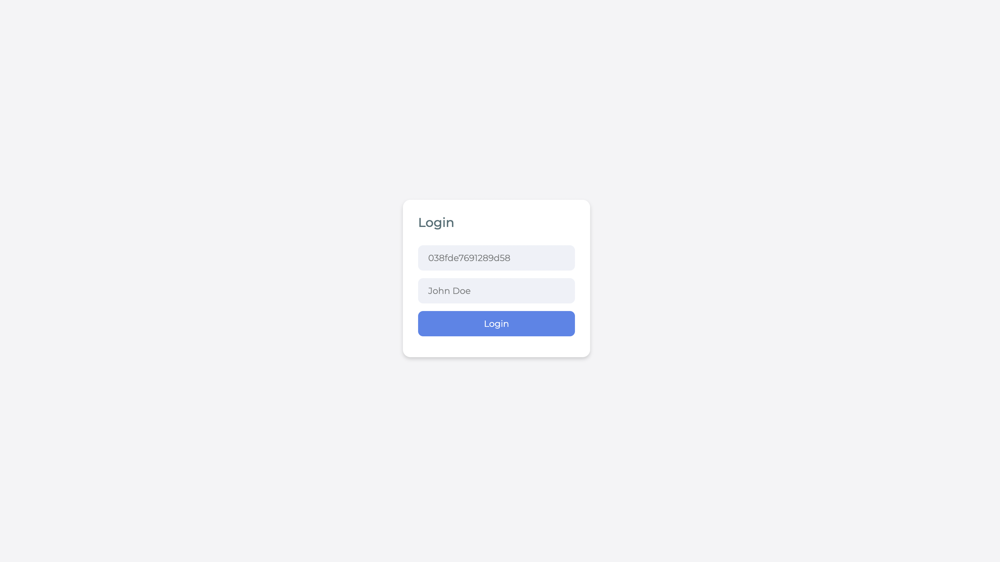
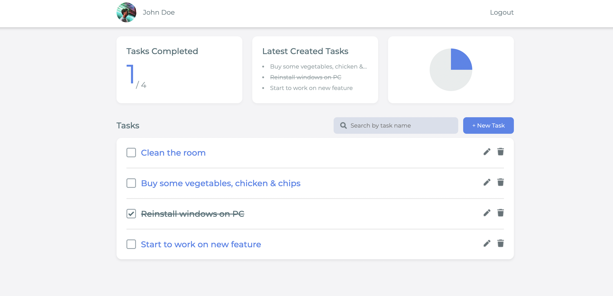
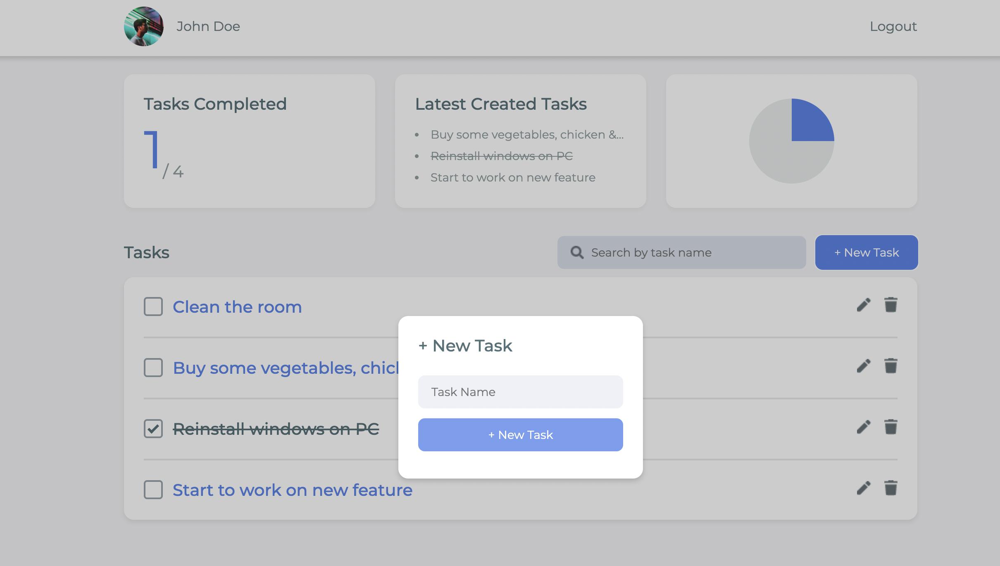
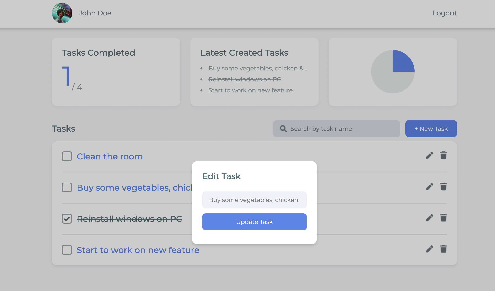
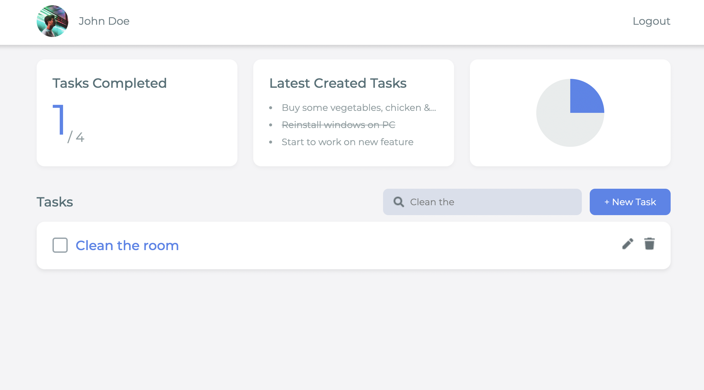
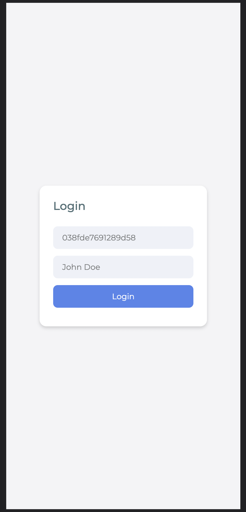
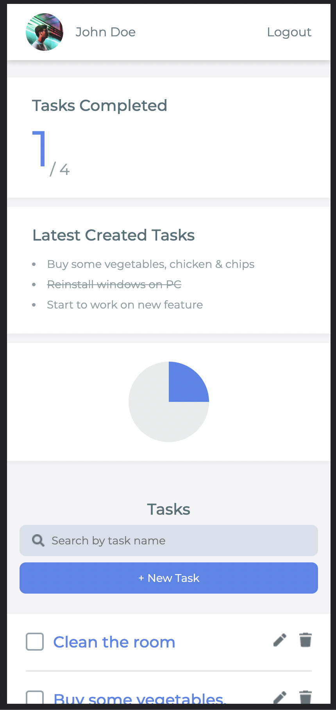
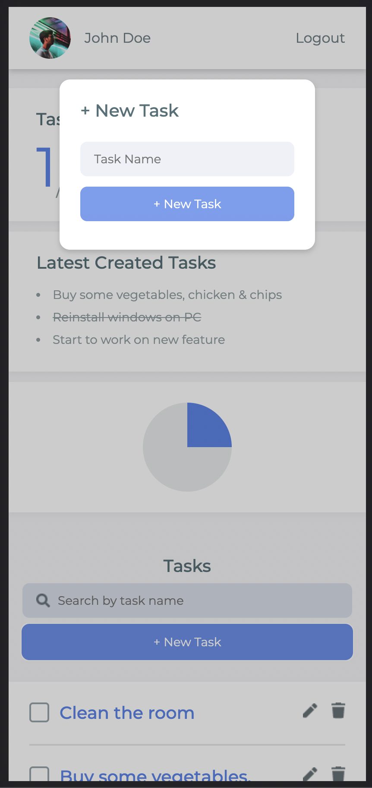
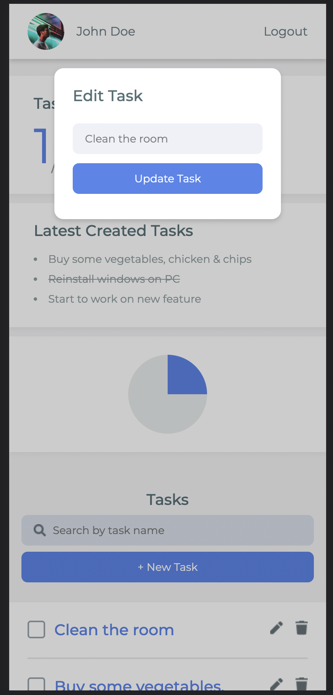

# 📓 Welcome to the Task App

This task app is powered by Vite, React.Js, Emotion, Redux and more.

## Installation Steps

Run the command below to clone and install dependencies

```bash
git clone https://github.com/densityx/task-app.git

npm install
```

To run the local server use the `dev` command

```bash
npm run dev
```

## Production

To view the project live in production visit the link below

- [Vercel](https://task-app-bay.vercel.app/)

## Run Test

To run the test, execute the command below.

```bash
npm run test
```

## Screenshots Preview









